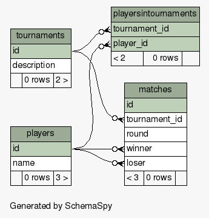

# Swiss Pairings Tournament Website

This repository implements the second project (a Swiss pairings tournament) in the Udacity Full Stack Nanodegree program.

Basic functions are implemented along with support for more than 1 tournament and support for calculation opponent wins to use as a tiebreaker when calculating player standings.

# Prerequisites
Requires Python. Tested with Python 2.7.6.

Requires PostgreSQL. Tested with PostgreSQL 9.3.6.

# How to Install
To download and install this program, you will need git installed.

At the command line, enter:
```
git clone https://github.com/alanriddle/fs_proj2_swiss_pairings.git
```
Change directory to fs_proj2_swiss_pairings.

# How to Setup Tournament Database
```
cd tournament
createdb tournament
psql tournament
\i tournament.sql
```

# How to Run Tests
At the command line, enter:
```
python test_tournament.py
```

# Table Diagrams
The directory tournament/docs/schema_spy contains html files with information about the tournament database.

To view, use an HTML browser to open the file docs/schema_spy/index.html.

Here is one of the diagrams.


